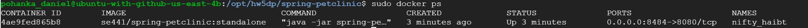
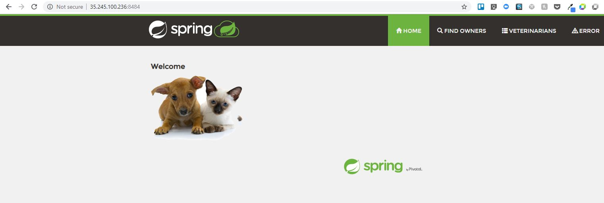
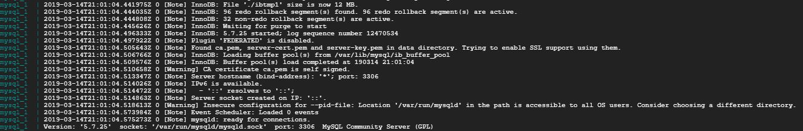
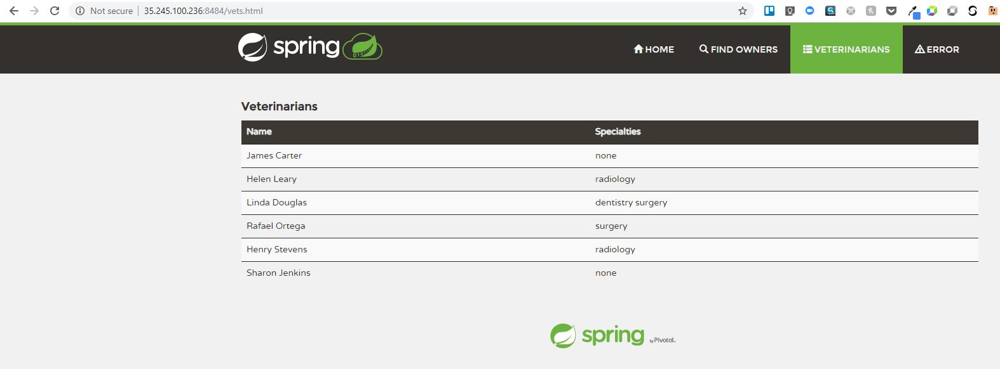
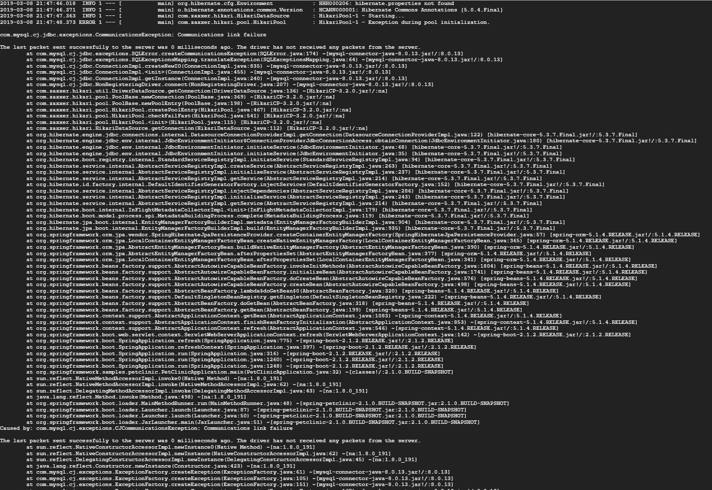
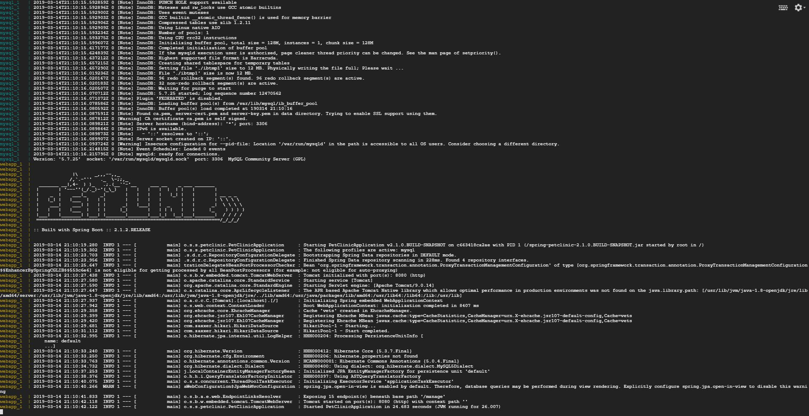

# Instructions
Daniel Pohanka  #1960300

Docker
- Dockerfile. Please provide a link to this file rather than a screen capture. [Dockerfile](Dockerfile) 
- The running docker instance as shown by a ps command. 
- Browser accessing the main page of the website from your local container. 

DOCKER COMPOSE - MYSQL ONLY
- The output from the docker-compose up command. 
- Browser accessing the “Veterinarians” page of the website from your local container when you run the application from the host system. 
- A section of the stack trace generated when you attempt to run the application container that has been updated to use MySQL. 

DOCKER COMPOSE - APP SERVER AND MYSQL
- Updated docker-compose.yml file containing the application server, built from your local Dockerfile, and the existing MySQL configuration. Please provide a link to this file rather than a screen capture. [docker-compose](docker-compose.yml)
- Updated application-mysql.properties file containing the URL change for the database server. Please provide a link to this file rather than a screen capture. [application-mysql.properties](src/main/resources/application-mysql.properties)
- The output from the docker-compose up command. 
- Browser accessing the “Veterinarians” page of the website from your local container. 
